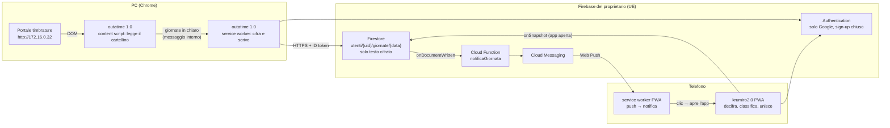
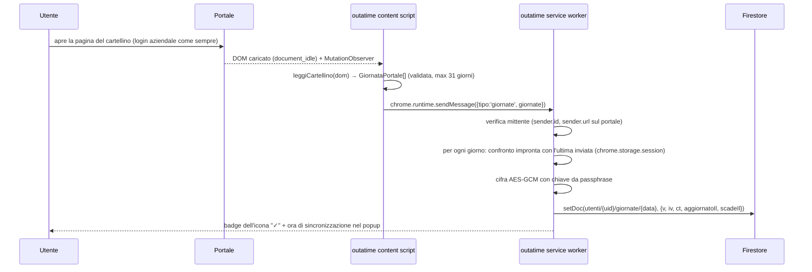
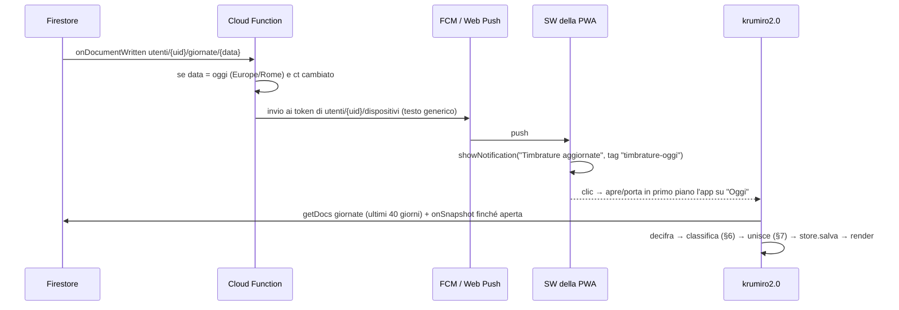

# Integrazione outatime → Firebase → krumiro2.0

Stato: **bozza F0 — proposta, da approvare in plenaria.** Le scelte marcate *(D<n>)* sono in
[decisions.md](decisions.md) con stato "proposta"; i punti aperti sono in [../README.md](../README.md#domande-aperte).
Il modello di sicurezza è in [sicurezza.md](sicurezza.md).

## 1. Obiettivo

> Accedo al portale timbrature normalmente; outatime salva sul **mio** Firebase l'aggiornamento della timbratura;
> una notifica aggiorna krumiro2.0. Tutto deve essere assolutamente sicuro.

Criterio di successo finale (M2): apro il portale sul PC aziendale → entro 60 s il telefono riceve la notifica
"Timbrature aggiornate" → tocco la notifica → krumiro2.0 mostra le timbrature del portale e l'uscita prevista
ricalcolata, senza che io abbia inserito nulla a mano.

## 2. Stato attuale (inventario del 2026-10-03)

### outatime (`gcampa/outatime`, commit `f655344`)

| Aspetto | Stato |
|---|---|
| Tipo | Estensione Chrome Manifest V3, versione `0.1`, un solo file `background.js` (~350 righe), nessuna build, nessun test |
| Attivazione | **solo al clic** sull'icona (`chrome.action.onClicked` → `chrome.scripting.executeScript`); nessun content script automatico |
| Portale | `http://172.16.0.32/*` (HTTP in chiaro, rete interna); `https` solo come permesso opzionale |
| Lettura | elementi `[data-giorno]` (valore `gg/mm/aaaa`) con figlio `.cartellino-portale-timb`; regex `((2[0-3]|[01][0-9]):[0-5][0-9])|([A-Z])\w+` sul testo; scarta le parole `SMART` e `WORKING` |
| Calcoli | ore "ufficiali" e "effettive", pausa pranzo minima 1h, "Ora di levarsi" (8:30–9:30 → 17:30 + ritardo) iniettati nella pagina |
| Uscita dati | `report` (array `{date, details}`) stampato con `console.log`; **non esce dal browser** |
| Permessi | `activeTab`, `scripting`, `storage` |

Difetti rilevati (non da "correggere" in outatime 0.1: la nuova versione non riusa questi calcoli, vedi D9):
- `new Date(year, month, day)` usa il mese non decrementato (mese successivo): le durate tornano, le date no.
- `mergeData` confronta `Date(w.date) == Date(e.date)` (stringa dell'ora corrente): sempre vero.
- `searchLunch` riscrive l'orario senza zeri iniziali (`"9:5"`), poi letto con `substr` → orari errati.
- Coppie `[orario, parola]` costruite a passo 2: una parola in più o in meno (es. `Nessuna timbratura`, una
  dicitura nuova) sfasa tutta la giornata.
- `document.head.innerHTML += …` a ogni clic: riscrive l'head della pagina del portale.

### krumiro2.0 (`gcampa/krumiro2.0`, branch base `main` @ `1440056`, versione `1.5.0`)

| Aspetto | Stato |
|---|---|
| Stack | TypeScript 5.9 senza framework, Vite 8, vite-plugin-pwa 1.3 (`generateSW`), Vitest 5, Node 22 |
| Dati | solo `localStorage` chiave `timbrature`, schema `version: 1`, migrazioni in `src/storage/migrazioni.ts` |
| Backend | **nessuno** ("i dati restano sul telefono", README) |
| Deploy | GitHub Pages via `.github/workflows/deploy.yml`; README indica `https://ricky79.github.io/krumiro2.0/` |
| Modello | `Giornata { data, permessoInizioMinuti, eventi: Evento[] }`, `Evento { id, tipo, minuti, pausaConfermata?, sigaretta? }` |
| Tipi evento | `ENTRATA`, `INIZIO_PAUSA`, `FINE_PAUSA`, `USCITA_PERMESSO`, `RIENTRO_PERMESSO`, `USCITA`, `USCITA_ANTICIPATA` |
| Baseline | 8 file di test, **92/92 verdi**; build ok, precache 16 voci (98.96 KiB) |

Conseguenza principale: il portale conosce solo **Entrata/Uscita** (più "per SMART WORKING"); krumiro2.0 distingue
pausa, permesso, sigaretta, uscita anticipata. Serve una **classificazione** (§ 6) e una regola di **unione** con i
dati inseriti a mano (§ 7).

## 3. Architettura proposta



Principi:
1. **Il portale è la fonte di verità; Firebase è solo un canale.** I dati su Firebase si possono cancellare in
   qualunque momento: la prossima apertura del portale li ricrea. Perdere la passphrase non costa nulla (D7).
2. **Cifratura end-to-end** (D6): Google/Firebase vedono solo testo cifrato, metadati minimi (data del giorno,
   istante di scrittura).
3. **Nessun segreto nell'estensione né nella PWA** oltre alla chiave derivata dalla passphrase dell'utente: le
   credenziali per inviare notifiche stanno solo nella Cloud Function (D10).
4. **krumiro2.0 continua a funzionare senza Firebase**: la sincronizzazione è opzionale, disattivata di default,
   e l'SDK Firebase si carica solo se attivata (D12).
5. **outatime trasmette timbrature grezze**, non calcoli: le regole di calcolo vivono solo in krumiro2.0 (D9).

## 4. Flussi

### 4.1 Scrittura (PC)

Solo i giorni **cambiati** si scrivono: nessuna scrittura (e nessuna notifica) se si riapre il portale senza
novità.

### 4.2 Notifica e lettura (telefono)

La notifica **non contiene dati** (orari, saldo): il testo è fisso, perché il server non può leggere nulla (D6).

## 5. Contratto dati

### 5.1 Contenuto in chiaro (prima della cifratura) — `GiornataPortale` v1
```ts
/** Versione 1 del contratto outatime → krumiro2.0. Solo questi campi, nessun altro. */
interface GiornataPortale {
  v: 1;
  /** 'YYYY-MM-DD', fuso Europe/Rome. */
  data: string;
  /** In ordine di orario, come compaiono nel cartellino. Massimo 20. */
  timbrature: { minuti: number; verso: 'E' | 'U'; smart: boolean }[];
  /** Istante della lettura, ISO 8601 UTC. */
  lettoIl: string;
}
```
- `minuti`: minuti dalla mezzanotte (0–1439), stessa convenzione di `Evento.minuti` di krumiro2.0.
- `verso`: `E` = "Entrata…", `U` = "Uscita…"; `smart` = la dicitura contiene "SMART WORKING".
- Giorni senza timbrature ("Nessuna timbratura"): `timbrature: []` — il giorno si scrive comunque, così una
  correzione sul portale che toglie timbrature arriva a krumiro2.0.
- Niente nome, matricola, URL del portale, HTML, cookie.

### 5.2 Documento Firestore
`utenti/{uid}/giornate/{data}` (id = `YYYY-MM-DD`):

| Campo | Tipo | Note |
|---|---|---|
| `v` | int = 1 | versione del formato cifrato |
| `iv` | string base64, 16 caratteri | 12 byte casuali, nuovi a ogni scrittura |
| `ct` | string base64, ≤ 4096 caratteri | AES-256-GCM di `JSON.stringify(GiornataPortale)`; AAD = `uid + '/' + data` |
| `aggiornatoIl` | timestamp | `serverTimestamp()`, imposto dalle regole `== request.time` |
| `scadeIl` | timestamp | `aggiornatoIl + 90 giorni`; politica TTL di Firestore (D13) |

`utenti/{uid}` (profilo): `{ v: 1, kdf: { alg: 'PBKDF2-SHA256', iter: 600000, sale: <base64 16 byte> }, verifica: { iv, ct } }`
— `verifica` è la cifratura della stringa fissa `krumiro-ok`: serve a dire "passphrase errata" invece di mostrare
dati corrotti.

`utenti/{uid}/dispositivi/{idDispositivo}`: `{ token: <token FCM>, creatoIl, ultimoUsoIl, scadeIl }` (D10).

L'AAD lega ogni testo cifrato al suo percorso: un documento copiato sotto un'altra data o un altro utente non si
decifra.

## 6. Classificazione Entrata/Uscita → eventi krumiro2.0 (proposta, vedi Domanda Q6)

Funzione pura `classificaPortale(timbrature, impostazioni, oggi, adesso) → Evento[]` in krumiro2.0
(`src/core/portale.ts`). Le timbrature si ordinano per `minuti`; la sequenza attesa alterna E/U.

| Caso | Evento krumiro2.0 |
|---|---|
| prima `E` | `ENTRATA` |
| coppia intermedia `U`→`E`, nessuna pausa ancora assegnata, l'intervallo interseca la fascia pranzo | `INIZIO_PAUSA` → `FINE_PAUSA` |
| altra coppia intermedia `U`→`E` | `USCITA_PERMESSO` → `RIENTRO_PERMESSO` |
| ultima `U` | `USCITA` |
| ultima `U` di **oggi**, nella fascia pranzo, pausa non ancora fatta | `INIZIO_PAUSA` (provvisorio: alla prossima `E` diventa coppia pausa) |
| sequenza non alternata (due `E` di fila, ecc.) | si importano gli eventi come sono; krumiro2.0 segnala già la giornata **da correggere** |

Ogni evento importato ha `origine: 'portale'` (campo opzionale nuovo, nessun cambio di `VERSIONE_CORRENTE`,
come fu per `sigaretta`).

## 7. Unione con i dati inseriti a mano (proposta, vedi Domanda Q5)

Per ogni giornata ricevuta, `unisciPortale(giornataLocale, eventiPortale) → { giornata, sostituiti }`
(`src/core/portale.ts`), funzione pura:
1. Gli eventi locali con `origine: 'portale'` si tolgono (verranno ricreati: l'import è idempotente).
2. Ogni evento manuale si abbina all'evento del portale con lo stesso **verso** (E/U) più vicino entro
   **10 minuti**. Abbinato → resta l'orario del portale, ma si conservano **tipo e annotazioni** manuali
   (`sigaretta`, `pausaConfermata`, `USCITA_ANTICIPATA`): così "Pausa sigaretta" toccata alle 10:15 e timbrata
   alle 10:16 resta una sigaretta.
3. Gli eventi manuali non abbinati **si tolgono** e si contano in `sostituiti`; la giornata precedente si salva
   in `timbrature-portale-annulla` (localStorage, una sola giornata) e un toast offre **Annulla** per 10 s.
4. `permessoInizioMinuti` (permesso a inizio giornata) resta quello locale.

## 8. Dove sta il codice (proposta, vedi Domanda Q2)

| Repository | Cartella | Contenuto |
|---|---|---|
| `gcampa/outatime` | `src/` | estensione MV3 in TypeScript, build Vite, test Vitest |
| `gcampa/krumiro2.0` | `src/core/portale.ts`, `src/sync/` | classificazione, unione, cifratura, client Firebase caricato a richiesta |
| `gcampa/krumiro2.0` | `firebase/` | `firestore.rules`, `firestore.indexes.json`, `functions/` (notifica), test delle regole sull'emulatore, `firebase.json` |
| `gcampa/krumiro2.0` | `docs/` | questa documentazione (unica per l'integrazione); outatime la linka |

Il codice di cifratura e il tipo `GiornataPortale` servono a entrambi: si **copiano** in outatime con un test di
compatibilità comune (vettori di prova cifrati in un repo e decifrati nell'altro), invece di creare un pacchetto
npm condiviso (D14).
