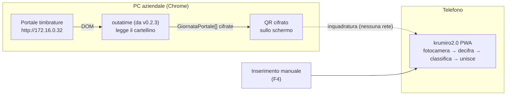
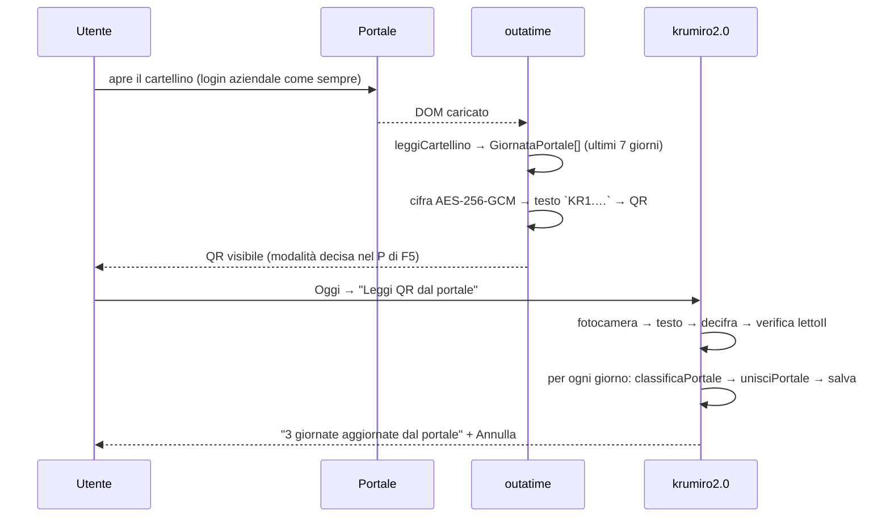

# Integrazione outatime → krumiro2.0 (trasferimento offline con QR)

Stato: **F0 — architettura approvata il 2026-10-03 (Q16-B, D19).** Nessun servizio esterno: i dati passano dallo
schermo del PC alla fotocamera del telefono. Il piano Firebase (D8) è scartato; le notifiche anche (D18).
Sicurezza in [sicurezza.md](sicurezza.md); regole di calcolo in [regole-outatime.md](regole-outatime.md).

## 1. Obiettivo

1. **Subito (F2)**: krumiro2.0 adotta la **gestione oraria di outatime** (Presenza, FILM, Smart working), con orari
   configurabili; timbro a mano.
2. **Poi (F4)**: inserisco a mano le timbrature come le mostra il portale (Entrata/Uscita) e krumiro2.0 le
   classifica e le unisce a quelle che ho toccato.
3. **Infine (F5–F6)**: apro il portale come sempre, outatime mostra un QR cifrato con le timbrature recenti,
   lo inquadro con krumiro2.0 e la giornata si aggiorna.

## 2. Stato attuale (inventario del 2026-10-03)

### outatime (`gcampa/outatime`, versione in uso **v0.2.3**, branch `firefox-support`)

Il branch predefinito `main` è fermo alla 0.1 (`f655344`, un solo `background.js`): la versione in uso è il tag
`v0.2.3` sul branch `firefox-support` (Q29). Regole di calcolo in [regole-outatime.md](regole-outatime.md).

| Aspetto | Stato v0.2.3 |
|---|---|
| Tipo | estensione MV3 per Chrome e Firefox; TypeScript, build esbuild (`build.mjs`), test Jest (`test/lib.spec.ts`, `test/content.spec.ts` con jsdom), CI e release con zip su GitHub |
| Attivazione | **content script automatico** su `*://172.16.0.32/*` e `*://polyedro.terranovasoftware.eu/*` (portale Polyedro di Terranova), `all_frames: true` |
| Lettura | `table.cartellino-portale-timb` dentro `[data-giorno]` (`gg/mm/aaaa`); orari da `tbody td span.default`, descrizione nella cella successiva ("Entrata", "Uscita", "… per SMART WORKING"); ore pagate dalla tabella riepilogo (`ORE ORDINARIE`, `BANCA ORE LUN - VEN MATURATA`, `STRAORDINARI AUT`, `SMART WORKING`); matricola e nome da `#matricola` |
| Calcoli | uscita minima (Presenza, FILM, Smart working), effettivi, volontariato, straordinari, iniettati nella pagina con classe `outatime-data` |
| Popup | una casella "Abilita FILM" (`chrome.storage.local.filmEnabled`) |
| Uscita dati | report per giorno in `localStorage` del portale (chiave `outatime\|<data>\|<matricola>\|<nome>`) e `console.log` del JSON; `tools/timetable-viewer.html` lo visualizza incollandolo a mano |
| Permessi | `activeTab`, `scripting`, `storage` |

Note di sicurezza su v0.2.3 da trattare in F5: il report in `localStorage` del portale e nella console contiene
matricola e nome (S10); `innerHTML` usato per iniettare righe con valori calcolati (S9).

### krumiro2.0 (`gcampa/krumiro2.0`, branch base `main` @ `1440056`, versione `1.5.0`)

| Aspetto | Stato |
|---|---|
| Stack | TypeScript 5.9 senza framework, Vite 8, vite-plugin-pwa 1.3 (`generateSW`), Vitest 5, Node 22 |
| Dati | solo `localStorage` chiave `timbrature`, schema `version: 1`, migrazioni in `src/storage/migrazioni.ts` |
| Backend | **nessuno** ("i dati restano sul telefono", README) |
| Deploy | GitHub Pages via `.github/workflows/deploy.yml`; README indica `https://ricky79.github.io/krumiro2.0/` |
| Modello | `Giornata { data, permessoInizioMinuti, eventi: Evento[] }`, `Evento { id, tipo, minuti, pausaConfermata?, sigaretta? }` |
| Tipi evento | `ENTRATA`, `INIZIO_PAUSA`, `FINE_PAUSA`, `USCITA_PERMESSO`, `RIENTRO_PERMESSO`, `USCITA`, `USCITA_ANTICIPATA` |
| Baseline | 8 file di test, **92/92 verdi**; build ok, precache 16 voci (98.96 KiB) |

Conseguenza principale: il portale conosce solo **Entrata/Uscita** (più "per SMART WORKING"); krumiro2.0 distingue
pausa, permesso, uscita anticipata. Serve una **classificazione** (§ 6) e una regola di **unione** con i
dati inseriti a mano (§ 7).

## 3. Architettura



Principi:
1. **Nessun dato lascia il PC attraverso la rete**: outatime non ha permessi di rete verso l'esterno; il QR è
   l'unico canale (rispetta le regole aziendali: Q1, Q16).
2. **Il portale è la fonte di verità** (D7): il QR porta le giornate intere; l'import è idempotente.
3. **Cifratura end-to-end** (D6): chi fotografa lo schermo non legge nulla; krumiro2.0 accetta solo QR prodotti
   dalla tua outatime (cifratura autenticata).
4. **outatime trasmette timbrature grezze** (D9): i calcoli restano in krumiro2.0.
5. **Classificazione e unione sono le stesse** per l'inserimento manuale (F4) e per il QR (F6): una sola
   funzione pura, `unisciPortale`.

## 4. Flusso (F5–F6)



## 5. Contratto dati

### 5.1 Contenuto in chiaro (prima della cifratura) — `GiornataPortale` v1
```ts
/** Versione 1 del contratto outatime → krumiro2.0. Solo questi campi, nessun altro. */
interface GiornataPortale {
  v: 1;
  /** 'YYYY-MM-DD', fuso Europe/Rome. */
  data: string;
  /** In ordine di orario, come compaiono nel cartellino. Massimo 20. */
  timbrature: { minuti: number; verso: 'E' | 'U'; smart: boolean }[];
  /** Ore pagate lette dal riepilogo del portale (somma delle voci di § 3 di regole-outatime.md); null se assenti. */
  pagatiMinuti: number | null;
  /** Istante della lettura, ISO 8601 UTC. */
  lettoIl: string;
}
```
- `minuti`: minuti dalla mezzanotte (0–1439), stessa convenzione di `Evento.minuti` di krumiro2.0.
- `verso`: `E` = "Entrata…", `U` = "Uscita…"; `smart` = la dicitura contiene "SMART WORKING".
- Giorni senza timbrature ("Nessuna timbratura"): `timbrature: []` — il giorno si scrive comunque, così una
  correzione sul portale che toglie timbrature arriva a krumiro2.0.
- `pagatiMinuti` serve al "volontariato" di outatime (effettivi − pagati).
- Niente nome, matricola, URL del portale, HTML, cookie.

### 5.2 Contenuto del QR (proposta, si fissa nel P di F5)

Testo `KR1.<iv base64url>.<ct base64url>`: `ct` = AES-256-GCM di `JSON.stringify({ v: 1, giornate:
GiornataPortale[] })`, al più 7 giornate (le ultime, oggi compreso). Stima: ~7 × 120 byte di JSON → ~1,2 KB di
testo, QR versione ≤ 25 con correzione d'errore M. Se non entra, si riducono i giorni, mai la cifratura.
La chiave (passphrase o QR di abbinamento) si decide nel P di F5 (Q23).

Regole di accettazione in krumiro2.0: prefisso e versione noti; decifratura riuscita (altrimenti "QR non
riconosciuto: non è della tua outatime o la chiave è cambiata"); ogni giornata valida come in
`normalizzaGiornata`; `lettoIl` non più vecchio di quello dell'ultimo QR importato per la stessa data (un QR vecchio
non cancella timbrature più recenti).

## 6. Classificazione Entrata/Uscita → eventi krumiro2.0 (approvata: D15)

Funzione pura `classificaPortale(timbrature, impostazioni, oggi, adesso) → Evento[]` in krumiro2.0
(`src/core/portale.ts`). Le timbrature si ordinano per `minuti`; la sequenza attesa alterna E/U.

| Caso | Evento krumiro2.0 |
|---|---|
| prima `E` | `ENTRATA` |
| coppia intermedia `U`→`E`, nessuna pausa ancora assegnata, l'intervallo interseca la fascia pranzo | `INIZIO_PAUSA` → `FINE_PAUSA` |
| altra coppia intermedia `U`→`E` | `USCITA_PERMESSO` → `RIENTRO_PERMESSO` |
| ultima `U` | `USCITA` |
| ultima `U` di **oggi**, nella fascia pranzo, pausa non ancora fatta | `INIZIO_PAUSA` (provvisorio: alla prossima `E` diventa coppia pausa) |
| sequenza non alternata (due `E` di fila, ecc.) | si importano gli eventi come sono; krumiro2.0 segnala già la giornata **da correggere** |

Ogni evento importato ha `origine: 'portale'` (campo opzionale nuovo, nessun cambio di `VERSIONE_CORRENTE`,
come fu per `sigaretta`).

## 7. Unione con i dati inseriti a mano (approvata: D15)

Per ogni giornata ricevuta (da inserimento manuale in F4 o da QR in F6), `unisciPortale(giornataLocale, eventiPortale) → { giornata, sostituiti }`
(`src/core/portale.ts`), funzione pura:
1. Gli eventi locali con `origine: 'portale'` si tolgono (verranno ricreati: l'import è idempotente).
2. Ogni evento manuale si abbina all'evento del portale con lo stesso **verso** (E/U) più vicino entro
   **10 minuti**. Abbinato → resta l'orario del portale, ma si conservano **tipo e annotazioni** manuali
   (`pausaConfermata`, `USCITA_ANTICIPATA`): così un'uscita anticipata toccata alle 16:00 e timbrata alle 16:01 resta
   un'uscita anticipata. (La pausa caffè non entra: è solo un cronometro, D31.)
3. Gli eventi manuali non abbinati **si tolgono** e si contano in `sostituiti`; la giornata precedente si salva
   in `timbrature-portale-annulla` (localStorage, una sola giornata) e un toast offre **Annulla** per 10 s.
4. `permessoInizioMinuti` (permesso a inizio giornata) resta quello locale.

## 8. Dove sta il codice

| Repository | Cartella | Contenuto | Fase |
|---|---|---|---|
| `gcampa/krumiro2.0` | `src/core/calcolo.ts`, `src/core/tipi.ts`, `src/storage/migrazioni.ts`, `src/ui/impostazioni.ts`, `src/ui/giorno.ts` | gestione oraria di outatime (D21) | F2 |
| `gcampa/krumiro2.0` | `src/core/portale.ts`, `src/ui/portale.ts` | classificazione, unione, inserimento manuale | F4 |
| `gcampa/outatime` | `src/` (da v0.2.3) | aggiunta di cifratura e QR all'estensione esistente (esbuild, Jest) | F5 |
| `gcampa/krumiro2.0` | `src/core/cifratura.ts`, `src/ui/leggiQr.ts` | decifratura, lettura QR | F6 |
| `gcampa/krumiro2.0` | `docs/` | documentazione unica (D16) | tutte |

Tipo `GiornataPortale` e cifratura esistono identici nei due repository con vettori di prova comuni (D14).
