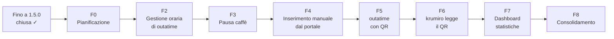

# Roadmap

Ogni fase si chiude con i propri criteri di uscita e una revisione obbligatoria. Metodo in
[gestione-fasi.md](gestione-fasi.md); avanzamento in [progress.md](progress.md). Ordine delle fasi approvato il
2026-10-03 (D20, aggiornato da D30); contenuti definitivi con R-F0.

| Fase | Contenuto | Uscita | Piano | Stato |
|---|---|---|---|---|
| Fino a 1.5.0 | calcolo, PWA, aiuto, tema, banner, pausa sigaretta | 92 test verdi, in `main` | `docs/superpowers/` | chiusa prima dell'adozione |
| F0 Pianificazione | architettura QR, sicurezza, regole outatime, decisioni, fasi | documenti approvati, domande di F2 chiuse | — | completa il 2026-10-03, in attesa di R-F0 |
| ~~F1 Design~~ | — | — | — | non prevista (D26): design delle schermate QR nel P di F5 |
| F2 Gestione oraria di outatime | configurazioni Presenza / FILM / Smart working con orari modificabili, FILM globale, smart working per giornata, uscita minima, finestra della pausa, Effettivi e Straordinari, "Ora di levarsi" (D21, Q24–Q28); migrazione v1→v2; pubblicazione su `gcampa.github.io` (D17) | dal browser i 17 casi di outatime danno la stessa "Ora di levarsi" (es. FILM attivo, Entrata 08:30, pausa 12:55–13:10 → 17:05; smart working, Entrata 07:15, pausa 12:30–15:00 → 17:45); app su `https://gcampa.github.io/krumiro2.0/` | [F2-gestione-oraria.md](F2-gestione-oraria.md) | pianificata: 17 task in 7 sessioni, 1 revisione (R1) + chiusura |
| F3 Pausa caffè | cronometro della pausa caffè (ogni 2h di lavoro): sigaretta o birra scelta nel profilo, durata configurabile (11 / 15 min), boccale che si svuota; nessuna timbratura, nessun permesso (D29, D31) | Profilo → Birra: "🍺 Pausa birra" → boccale, timer 15:00; "Fine pausa" → "Pausa birra: N min", ore e saldo invariati | [F3-pausa-caffe.md](F3-pausa-caffe.md) | pianificata: 7 task; sessioni nel P di F3 |
| F4 Inserimento manuale dal portale | import dei JSON scaricati dal portale (D33, formato in Q33) e dialogo "Timbrature dal portale" (Entrata/Uscita e ore pagate), classificazione e unione (D15), etichetta "portale", Annulla, 💸 Volontariato | scrivo le timbrature del cartellino di oggi → la giornata si aggiorna, uscita anticipata toccata a mano conservata, Annulla ripristina | F4-inserimento-portale.md | da fare |
| F5 outatime con QR | estensione di outatime da `main` (= v0.2.3, D22): contratto `GiornataPortale`, cifratura, QR nel popup o nella pagina; schermate in `pages-and-widgets.md` | apro il cartellino → outatime mostra il QR; nessuna richiesta di rete esterna | F5-outatime-qr.md | da fare |
| F6 krumiro2.0 legge il QR | fotocamera, decifratura, riuso di F4, rifiuto di QR vecchi o estranei | inquadro il QR → le giornate si aggiornano; QR estraneo → rifiutato | F6-leggi-qr.md | da fare |
| F7 Dashboard statistiche | da pianificare dopo l'import dei dati (D34) | — | — | da fare |
| F8 Consolidamento | revisione di sicurezza S1–S17, CSP, Aiuto e README, E2E di F2–F6 | revisione di sicurezza superata | F8-consolidamento.md | da fare |

| Milestone | Fasi | Risultato |
|---|---|---|
| M0 | F0 | Piano approvato |
| M1 | F2–F3 | Gestione oraria di outatime in krumiro2.0, pubblicata da `gcampa` (uso quotidiano); pausa caffè |
| M2 | F4–F6 | Acquisizione dal portale: prima a mano, poi con il QR |
| M3 | F7–F8 | Dashboard di statistiche e revisione di sicurezza: pronto |
