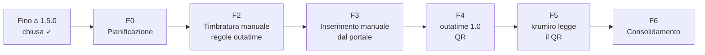

# Roadmap

Ogni fase si chiude con i propri criteri di uscita e una revisione obbligatoria. Metodo in
[gestione-fasi.md](gestione-fasi.md); avanzamento in [progress.md](progress.md). Ordine delle fasi approvato il
2026-10-03 (D20); contenuti definitivi con R-F0.

| Fase | Contenuto | Uscita | Piano | Stato |
|---|---|---|---|---|
| Fino a 1.5.0 | calcolo, PWA, aiuto, tema, banner, pausa sigaretta | 92 test verdi, in `main` | `docs/superpowers/` | chiusa prima dell'adozione |
| F0 Pianificazione | architettura QR, sicurezza, regole outatime, decisioni, fasi | documenti approvati, domande di F2 chiuse | — | in corso: D19, D20 approvate; Q18–Q22 aperte |
| ~~F1 Design~~ | — | — | — | deroga proposta (Q11): design delle schermate QR nel P di F4 |
| F2 Timbratura manuale con le regole di outatime | pausa minima, fascia pranzo, fascia di ingresso, smart working, etichette e totali (Q18–Q22); pubblicazione su `gcampa.github.io` (D17) | dal browser: Entrata 08:45, pausa 13:00–13:40 → "Ora di levarsi" 17:45, come outatime; app pubblicata su `https://gcampa.github.io/krumiro2.0/` | F2-regole-outatime.md | da fare |
| F3 Inserimento manuale dal portale | dialogo "Timbrature dal portale" (Entrata/Uscita), classificazione e unione (D15), etichetta "portale", Annulla | scrivo le timbrature del cartellino di oggi → la giornata si aggiorna, sigaretta toccata a mano conservata, Annulla ripristina | F3-inserimento-portale.md | da fare |
| F4 outatime 1.0 con QR | estensione TypeScript con build e test, parser del cartellino, cifratura, QR; schermate in `pages-and-widgets.md` | apro il cartellino → outatime mostra il QR; nessuna richiesta di rete esterna | F4-outatime-qr.md | da fare |
| F5 krumiro2.0 legge il QR | fotocamera, decifratura, riuso di F3, rifiuto di QR vecchi o estranei | inquadro il QR → le giornate si aggiornano; QR estraneo → rifiutato | F5-leggi-qr.md | da fare |
| F6 Consolidamento | revisione di sicurezza S1–S17, CSP, Aiuto e README, E2E di F2–F5 | revisione di sicurezza superata | F6-consolidamento.md | da fare |

| Milestone | Fasi | Risultato |
|---|---|---|
| M0 | F0 | Piano approvato |
| M1 | F2 | Timbratura manuale con le regole di outatime, pubblicata da `gcampa` (uso quotidiano) |
| M2 | F3–F5 | Acquisizione dal portale: prima a mano, poi con il QR |
| M3 | F6 | Revisione di sicurezza: pronto |
